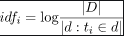
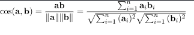

# VSM
#### Web Information Retrieval | Vector Space Model (VSM)

VSM used in finding relevant documents with respect to a given query. In VSM, each document or query is a N-dimensional vector 
where N is the number of distinct terms over all the documents and queries.The i-th index of a vector contains 
the score of the i-th term for that vector.
```vue
- The Vector Space Model for Information Retrieval represents documents and queries as vectors of weights.
- The weights represent the importance of the terms (aka words, tokens) in the documents and queries.
- Each weight is a measure of the importance of an index term in a document or a query, respectively.
```
#### The main score functions are based on: Term-Frequency (tf) and Inverse-Document-Frequency(idf).

Term-Frequency and Inverse-Document Frequency – The Term-Frequency (tf_{ij}) is computed with respect to the i-th term and j-th document where $ n_{i, j} are the occurrences of the i-th term in the j-th document.

The idea is that if a document has multiple receptions of given terms, it will probably deals with that argument.
The Inverse-Document-Frequency (idf_{i}) takes into consideration the i-th terms and all the documents in the collection 



The intuition is that rare terms are more important that common ones : if a term is present only in a document it can mean that term characterizes that document.
The final score for the i-th term in the j-th document consists of a simple multiplication Since a document/query contains only a subset of all the distinct terms in the collection, the term frequency can be zero for a big number of terms : this means a sparse vector representation is needed to optimize the space requirements.

#### Cosine Similarity
```vue
In order to compute the similarity between two vectors : a, b (document/query but also document/document)
the cosine similarity is used :
 ```
 

### The algorithm steps for VSM are:
   
```vue,
1- Collecting and preprocessing documents
2- Creating a vocabulary of unique terms
3- Representing each document as a vector
4- Representing each query as a vector
5- Calculating the similarity between each document vector and the query vector
6- Ranking documents based on their similarity to the query
```

